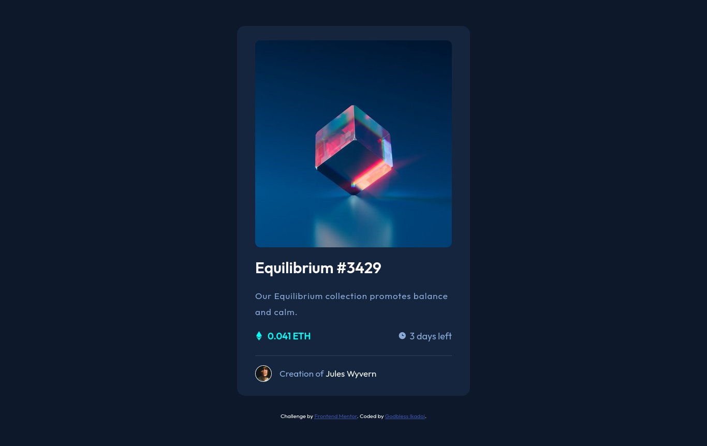
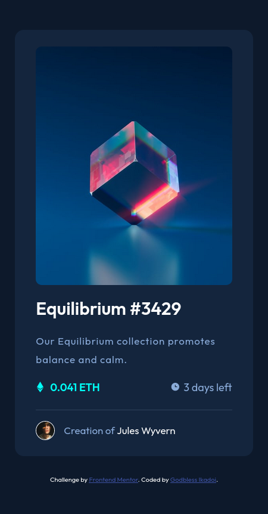

# Frontend Mentor - NFT preview card component solution

This is a solution to the [NFT preview card component challenge on Frontend Mentor](https://www.frontendmentor.io/challenges/nft-preview-card-component-SbdUL_w0U). Frontend Mentor challenges help you improve your coding skills by building realistic projects.

## Table of contents

- [Overview](#overview)
  - [The challenge](#the-challenge)
  - [Screenshot](#screenshot)
  - [Links](#links)
- [My process](#my-process)
  - [Built with](#built-with)
  - [What I learned](#what-i-learned)
  - [Continued development](#continued-development)
- [Author](#author)

## Overview

### The challenge

Users should be able to:

- View the optimal layout depending on their device's screen size
- See hover states for interactive elements

### Screenshot

### Links

- Solution URL: [github.com/TariCodes/frontend-mentor-challenge/tree/main/nft-preview-card-component-main](https://github.com/TariCodes/frontend-mentor-challenge/tree/main/nft-preview-card-component-main)
- Live Site URL: [taricodes-nft-component.netlify.app](https://taricodes-nft-component.netlify.app)

## My process

### Built with

- Semantic HTML5 markup
- CSS custom properties
- Flexbox
- Mobile-first workflow
- LESS
- BEM

### What I learned

This project taught me how to use BEM, a methodology for naming classes and id's. Also I delved deeper on installing LESS and using it in my workflow. How to configure less-watcher to automatically watch changes in my less and css outputs.
I learnt how use the css-minify to minify my css codes.

### Continued development

I'd like to improve in my naming convention using the BEM methodology and getting more knowledge on LESS and using responsive font-sizes.

## Author

- Frontend Mentor - [@TariCodes](https://www.frontendmentor.io/profile/@TariCodes)
- Twitter - [@TariCodes](https://www.twitter.com/@TariCodes)
- LinkedIn - [Godbless Ikadoi](https://www.linkedin.com/in/godbless-ikadoi-b61b042b0)
