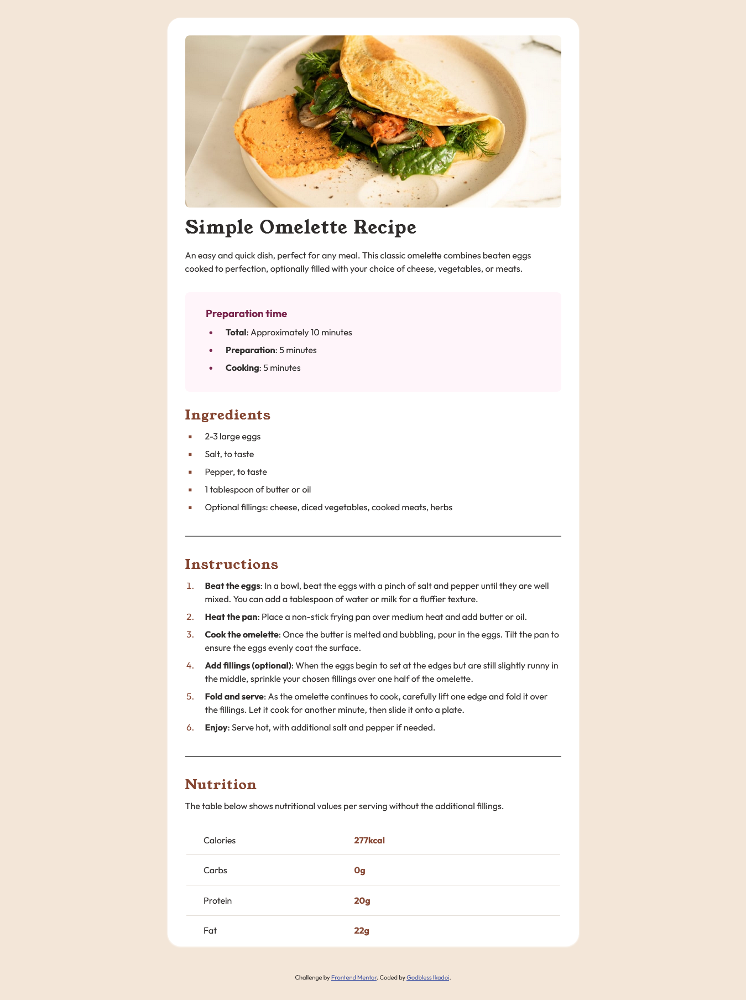
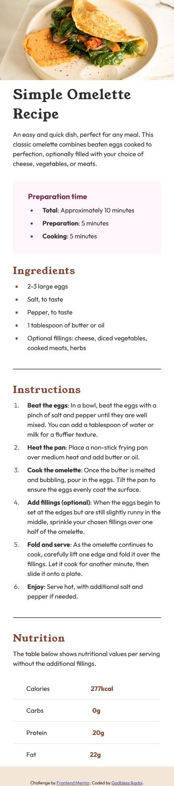

# Frontend Mentor - Recipe page solution

This is a solution to the [Recipe page challenge on Frontend Mentor](https://www.frontendmentor.io/challenges/recipe-page-KiTsR8QQKm). Frontend Mentor challenges help you improve your coding skills by building realistic projects. 

## Table of contents

- [Overview](#overview)
  - [The challenge](#the-challenge)
  - [Screenshot](#screenshot)
  - [Links](#links)
- [My process](#my-process)
  - [Built with](#built-with)
- [Author](#author)

## Overview

### Screenshot

### Links

- Solution URL: [https://github.com/TariCodes/frontend-mentor-challenge/tree/main/recipe-page-main](https://github.com/TariCodes/frontend-mentor-challenge/tree/main/recipe-page-main)
- Live Site URL: [https://taricodes-recipe-page.netlify.app](https://taricodes-recipe-page.netlify.app)

## My process

### Built with

- Semantic HTML5 markup
- CSS custom properties

## Author
-LinkedIn - [Godbless Ikadoi](https://www.linkedin.com/in/godbless-ikadoi-b61b042b0)
- Frontend Mentor - [@TariCodes](https://www.frontendmentor.io/profile/@TariCodes)
- Twitter - [@tariCodes](https://www.twitter.com/tariCodes)